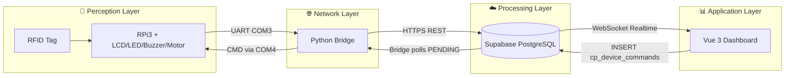
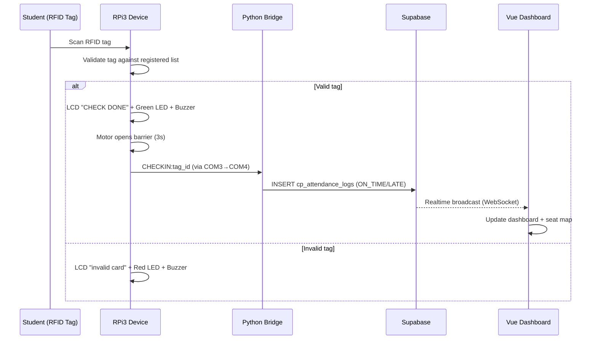
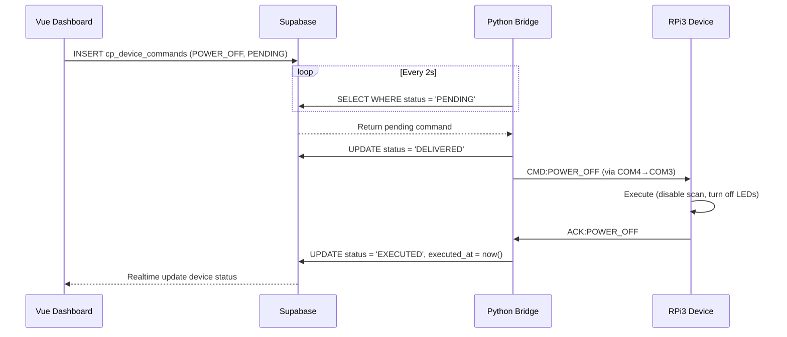
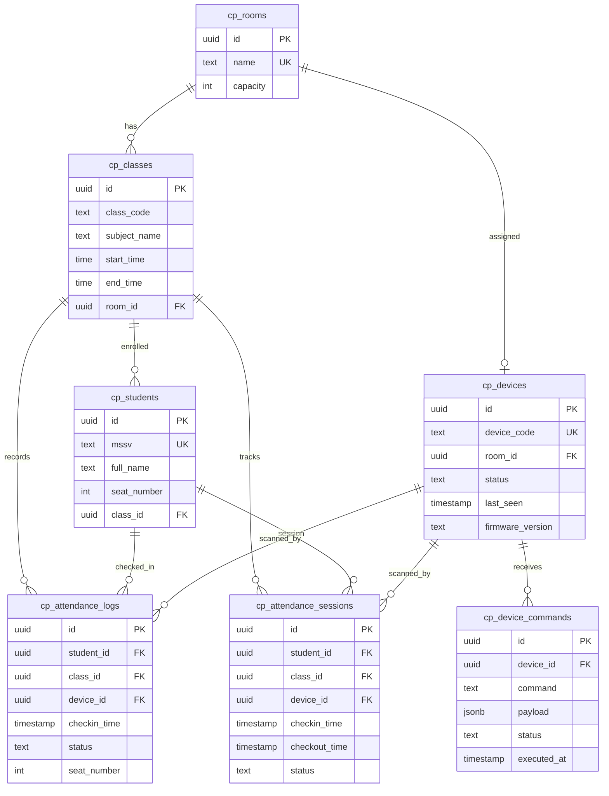

# Class Presence

IoT-based automatic attendance system. An RFID check-in device (Raspberry Pi 3, simulated in Proteus) communicates through a serial bridge to a Supabase backend, with a Vue 3 teacher dashboard for real-time monitoring and device control.

## Architecture



**Four-layer IoT model:**

| Layer       | Role                                    | Implementation                                                  |
| ----------- | --------------------------------------- | --------------------------------------------------------------- |
| Perception  | Collect data, provide feedback          | RPi3, RFID reader (VT1), LCD I2C, LEDs, Buzzer, Motor HAT       |
| Network     | Transport data between device and cloud | UART serial (COM3↔COM4 virtual pair), Python bridge, HTTPS REST |
| Processing  | Store, authenticate, broadcast          | Supabase PostgreSQL, Google OAuth, Row-Level Security, Realtime |
| Application | Visualize and control                   | Vue 3 SPA, Vuetify 3, Chart.js, Supabase Realtime subscriptions |

## Features

### Dashboard

- **Google OAuth** — Supabase Auth with per-route guards; all routes protected by default
- **Real-time attendance monitoring** — line chart (weekly trend), doughnut (on-time/late/absent distribution), bar chart (cross-class comparison), activity timeline
- **Class attendance detail** — student table with status badges, interactive seat map (3×5 grid, color-coded), attendance rate with 80% threshold warning
- **Weekly schedule** — time grid 07:00–17:00 Mon–Sat, week/day toggle, current-time highlight
- **Device management** — online/offline status cards, edit device info, send remote commands (power on/off, start/stop scan, restart)
- **Theme toggle** — dark/light mode persisted in localStorage

### Device (Proteus)

- **RFID check-in** — scan tag via Virtual Terminal (simulates RFID reader), validate against registered tags, display result on LCD 16×2
- **Visual/audio feedback** — green LED (GPIO19) + short buzzer for valid, red LED (GPIO18) + long buzzer for invalid
- **Check-in / check-out** — first scan = check-in, second scan = check-out (tracks actual session duration)
- **Live counter** — COUNT button (GPIO4) displays current check-in count on LCD
- **Barrier control** — AF Motor HAT (I2C) drives DC motor to open/close gate on valid check-in
- **Heartbeat** — sends `HEARTBEAT` every 30s over serial; dashboard shows online/offline based on `last_seen`
- **Remote command execution** — listens for `CMD:*` messages from bridge, executes and responds with `ACK:*`
- **Offline queue** — buffers attendance logs when serial/cloud is unavailable, syncs on reconnect

## Check-in Flow



## Device Control Flow



## Serial Protocol

Newline-delimited messages over UART (9600 baud, 8N1):

```
Device → Bridge:
  CHECKIN:<tag_id>       # valid tag scanned (check-in)
  CHECKOUT:<tag_id>      # same tag scanned again (check-out)
  HEARTBEAT              # alive signal (every 30s)
  ACK:<command>          # command executed successfully

Bridge → Device:
  CMD:POWER_ON           # enable device
  CMD:POWER_OFF          # disable device
  CMD:START_SCAN         # enter scan mode
  CMD:STOP_SCAN          # exit scan mode
```

Bridge translates serial messages to Supabase REST calls:

- `CHECKIN` → `INSERT INTO cp_attendance_logs` (status = `ON_TIME` or `LATE` based on class schedule)
- `CHECKOUT` → `UPDATE cp_attendance_sessions SET checkout_time = now()`
- `HEARTBEAT` → `UPDATE cp_devices SET last_seen = now(), status = 'ONLINE'`
- Polls `cp_device_commands WHERE status = 'PENDING'` → sends `CMD:*` → marks `DELIVERED` → on `ACK:*` marks `EXECUTED`

## Database

Supabase PostgreSQL 17. All tables prefixed `cp_`, RLS enabled, UUID PKs.

**RLS policies:** authenticated users can SELECT all tables and INSERT commands; only service_role (bridge) can write attendance data.



## Tech Stack

| Component | Technology                                                                     |
| --------- | ------------------------------------------------------------------------------ |
| Frontend  | Vue 3 (Composition API, `<script setup>`), Vuetify 3, Chart.js via vue-chartjs |
| Auth      | Supabase Auth (Google OAuth provider)                                          |
| Database  | Supabase PostgreSQL 17 with RLS                                                |
| Realtime  | Supabase Realtime (Postgres Changes over WebSocket)                            |
| Bridge    | Python 3 (pyserial, requests)                                                  |
| Device    | Raspberry Pi 3 on Proteus 8.15 VSM (Visual Designer flowchart)                 |
| Build     | Vite 7, TypeScript 5.9, Yarn 4 (Berry)                                         |

## Getting Started

```bash
yarn install
cp .env.example .env   # set VITE_SUPABASE_URL and VITE_SUPABASE_ANON_KEY
yarn dev               # http://localhost:5173
```
